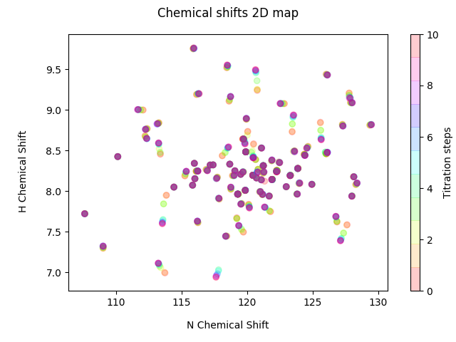
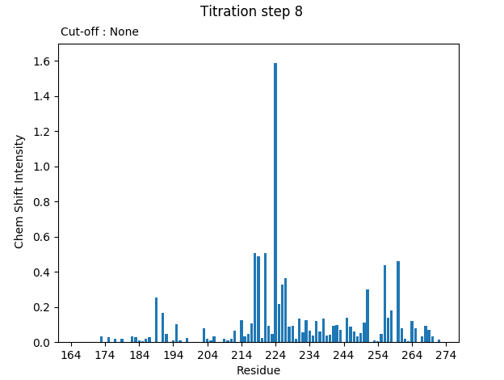
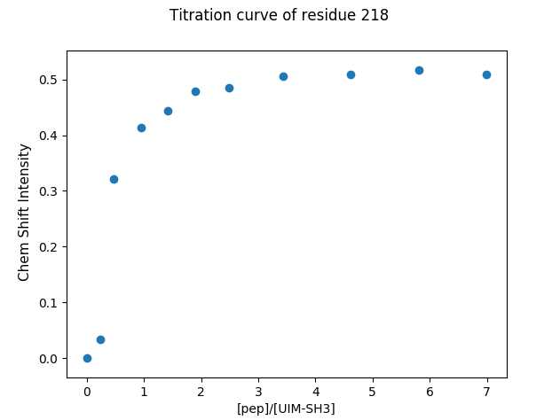

# Table of contents
----
1. [Installation](#installation)
2. [Command Line](#command-Line)

	2.1. [Protocole Commands](#protocole-commands)
    - [status ](#status)
    - [dump_protocole](#dump_protocole)
    - [init](#init)
    - [set_volumes ](#set_volumes)
    - [add_volumes](#add_volumes)
    - [set_name ](#set_name)
    - [csv](#csv)

    2.2. [NMR Analysis Commands](#nmr-analysis)
    + [Initiate the analysis Commands](#initiate)
       	* [summary](#summary)
    	* [add_step](#add_step)
    	* [load_job](#load_job)
    	* [update](#update)
    + [Filter and select the residues Comands](#filter_resiudes)
       	* [cutoff](#cutoff)
    	* [select](#select)
    	* [deselect](#deselect)
    	* [filter](#filter)
    	* [residues](#residues)
    + [Graph generators commands](#graph)
    	* [shiftmap](#shiftmap)
    	* [hist](#hist)
    	* [curve](#curve)
    + [Save Command](#save_)
    	* [save_job](#save_job)
    + [Shell and Python Commands](#shell_python)
    	* [py](#py)
    	* [pyscript](#pyscript)
    	* [shell](#shell)
    	* [shortcuts](#shortcuts)
    + [History and Exit the program](#history_exit)
    	* [history](#history)
    	* [quit](#quit)


3. [Examples](#examples)
4. [Authors](#authors)
5. [About](#about)
6. [Licence](#licence)

----


Shift2Me :sparkles: : 2D-NMR chemical shifts analyzer for protein protein interactions (PPI).
===============================
---
Shift2me is a 2D-NMR chemical shifts analyzer for PPI. The goal of the program is to identify the residues implicated in a PPI.

Given a .list file format, which contains the Residues numbers and the chemical shifts of 15N and 1H, the program will calculate the delta of the chemical shifts for each titration done during the experience.

Different graphs will be generated at the end.

- __A map2D__ : Two-dimensional graph wich shows the evolution of the chemicals shifts of 15N and 1H during each titration for all the residues.

- __Histogram__ : A histogram for each titration will show the delta of the chemical shifts in function of the residue number. In order to select the residues implicated in a PPI, the user can choose a cutoff.

- __Curves__ : A curve can be generated for each residue implicated in a PPI. The curve shows the delta of the chemical shifts of the residue in fuction of the the ratio of the concentration of the titrant protein to the concentration of the titrated protein.
- In __GUI__ mode, a representation 3D of the protein structure is added. The user can choose a PDB code, the residues numbers and change the representation mode.

# Installation <a name="installation"></a>
----
To install Shift2Me, you should clone the [**GitHub project**](https://github.com/masterbioinfo/projetwalker) via a Linux terminal :
```
git clone https://github.com/masterbioinfo/projetwalker.git
```
Then install all the dependancies of the requirements.txt file
```
pip3 install -r requirements.txt
```

# Command Line <a name="command-Line"></a>
----
Once the cloning has finished, you should use the command **cd, to open the directory that contains the program Shif2Me  :
```
cd projetwalker
```
The commands that launch Shift2Me program are :

```
python3 shift2me.py [-c <cutoff>] [-i <titration.yml>] [-t <file.yml>] ( <dir> | <saved_job> )
```
To obtain help
```    
python3 shift2me.py -h
```
```
Options:

 -c <cutoff> --cut-off=<cutoff>         			   Set default cutoff at <cutoff> (float).
 -i <titration.yml>, --init-file=<titration.yml>     Initialize titration from file.yml (YAML format)
 -t <file.yml>, --template=<file.yml>                Initialize a template titration.yml file,
                                                        to be filled with titration parameters.
 -h --help                                             Print help and usage
```
The user should indicate a directory as option to the program. Every file added after the program is launched will be saved to the directory indicated.

Once the program launched, a shell terminal will be appear. After analyzing the data files, a summary of iformation will show up :

	* Source dir 		-> the data path
	* Steps				-> the number of steps experiments
	* Cutoff			-> cutoff selected
	* Total reisdues	-> Total residus in the study
		- Complete residues 	-> Total residues in the study
 		- Incomplete residues	-> Number of residues with incomplete informations (not retained in the study)
 		- Filtered residues		-> Number of residus filtered (0 in the first time)

By typing help or ? a list of all commmands disponible will appear.
```
help or ?
```

To show more information for one specific command type :

```
help <comand>
```

## Protocole manipulation Commands <a name="protocole-commands"></a> :
Commands used to set the experience settings such as the volume added for each titration, concentration etc.

* #### status command <a name="status"></a> :

```
Outputs titration parameters, and current status of protocole.

Usage : status

```

output :

| Step | Added titrant (µL) | Total titrant (µL) | Total volume (µL) | [titrant] (µM) | [analyte] (µM) | [titrant]/[analyte] |
|------|--------------------|--------------------|-------------------|----------------|----------------|---------------------|


* #### dump_protocole command <a name="dump_protocole"></a> :
This command will output a YAML file that contains all the protocole settings. The user can fill the template with all the experience parameters. Notice that all volumes are in **µL** and concentrations are in **µM**.
```
Outputs titration parameters.
Argument may be a file path to write into. Defaults to stdout.

Usage : dump_protocole <file_name>
```

The .yml template file contains all the following informations :
```
_description: This file defines a titration's initial parameters.
name: Unnamed Titration
analyte:
    concentration: 0
    name: analyte
titrant:
    concentration: 0
    name: titrant
start_volume:
    analyte: 0
    total: 0
add_volumes:
- 0
```

* #### init command <a name="init"></a> :

```
Loads a YAML formatted file.yml describing titration protocole.
        To generate a template protocole descriptor as <file> :
            $ dump_protocole <file>.yml

Usage: init <protocole>.yml

Options:
  -h, --help  show this help message and exit

```

* #### set_volumes command <a name="set_volumes"></a> :
```
Sets added titrant volumes for current titration, replacing existing volumes.

Usage: set_volumes <vol (µL)> <vol (µL)> ...

Options:
  -h, --help  show this help message and exit
```

* #### add_volumes command <a name="add_volumes"></a>:
```
Add volumes to currently existing volumes in titration.

Usage: add_volumes <vol(µL)> [<vol(µL)> ...]

Options:
  -h, --help  show this help message and exit

```

* #### set_name command <a name="set_name"></a> :
```
Sets titration name

Usage: set_name Ubiquitin
```

* #### csv command <a name="csv"></a>:
```
Prints each titration step experimental conditions, such as volumes and concentration of each molecule.
        Format is comma-separated CSV table. You may redirect its output :
         $ csv path/to/file.csv
         $ csv > path/to/file.csv

Usage: csv [<path/to/file.csv>]

Options:
  -h, --help  show this help message and exit

```
Outputs titration parameters, and current status of protocole.


## NMR analysis Commands <a name="nmr-analysis"></a> :
Commands that will analyse tha data provided by the NMR experience and generate the graphs as described in the Introduction section.

### Initiate the analysis <a name="initiate"></a> :

* #### summary command <a name="summary"></a> :

```
Prints a summary of current titration state

Usage : summary
```
Output :
```
* Source dir 		-> the data path
* Steps				-> the number of steps experiments
* Cutoff			-> cutoff selected
* Total reisdues	-> Total residus in the study
	- Complete residues 	-> Total residues in the study
	- Incomplete residues	-> Number of residues with incomplete informations (not retained in the study)
	- Filtered residues		-> Number of residus filtered (0 in the first time)
```

* #### add_step command <a name="add_step"></a> :
```
Add a titration file as next step. Associate a volume to this step with -v option.
        Example : add_step titration_10.list -v 10

	Usage: add_step [options] <titration_file_##.list>

	Options:
  	-h, --help            show this help message and exit
  	-v VOLUME, --volume=VOLUME
                        Volume of titrant solution to add titration step
```
* #### load_job <a name="load_job"></a> :
For more information about this command, see also the **[save_job](#save_job) command.

```
Loads previously saved titration, replacing active titration

Usage : load_job <file_saved_path>

```
* #### update command <a name="update"></a>:
```
Update titration from <source>.
        If source is a directory, will add all the .list files
        with appropriate naming regarding expected next steps.
        If source is a list of files, add all the files,
        checking they have correct name regarding expected steps.
        No argument uses directory from first invocation, looking for
        any new step .list files in it.
        Already loaded files are ignored.

Usage: update [ <directory> | <titration_file.list> ... ]

Options:
  -h, --help  show this help message and exit

```

### Filter and select residues <a name="filter_resiudes"></a> :
---


* #### cutoff command <a name="cutoff"></a>:
```
Sets cutoff value to filter residues with high chemshift intensity.

Usage: cutoff [options] <float>

Options:
  -h, --help  show this help message and exit
  -p, --plot  Set cut-off and plot.
```

* #### select command <a name="select"></a>:
```
Select a subset of residues, either from :
         - a predefined set of residues
         - 1 or more slices of residue positions, with python-ish syntax.
        Examples :
            ':100' matches positions from start to 100
            '110:117' matches positions from 100 to 117 (excluded)
            '105 112:115' matches positions 105 and 112 to 115 (excluded)
        You may mix argument types, like select filtered residues + res #100 to #110 excluded :
            >> select filtered 100:110
        Non existant residues are skipped with a warning message.
        Finally, selection is additive only, each selected element adds up to previous selection.
        If you want to clear the current selection, use deselect command.

Usage: select [all] [filtered] [complete] [incomplete] [positions_slice]

Options:
  -h, --help  show this help message and exit
```

* #### deselect command <a name="deselect"></a>:
```
Remove a subset of residues from current selection, specifying either :
         - a predefined set of residues
         - 1 or more slices of residue positions, with python-ish syntax.
           e.g : ':100' matches positions from start to 100
                 '110:117' matches positions from 100 to 117 (excluded)
                 '105 112:115' matches positions 105 and 112 to 115 (excluded)
        You may mix argument types, like deselect filtered residues + res #100 to #110 excluded :
            >> deselect filtered 100:110
        Deselection will silently ignore on currently non-selected residue.

Usage: deselect arg

Options:
  -h, --help  show this help message and exit

```
* #### filter command <a name="filter"></a>:
```
Output residues having intensity >= cut-off
Usage: filter arg

Options:
  -h, --help  show this help message and exit
```

* #### residues command <a name="residues"></a>:
```
Output specific titration infos to standard output
Usage: residues ( filtered | selected | complete | incomplete )

Options:
  -h, --help  show this help message and exit

```
### Graph generator Commands <a name="graph"></a> :
---

* #### shiftmap command <a name="shiftmap"></a> :
```
Plot chemical shifts for H and N atoms for each residue at each titration step.

Usage: shiftmap [options] ( complete | filtered | selected )

Options:
  -h, --help            show this help message and exit
  -s, --split           Sublot each residue individually.
  -e EXPORT, --export=EXPORT
                        Export 2D shifts map as .png image file
```

* #### hist command <a name="hist"></a>:
```
 Plot chemical shift intensity per residu as histograms
        Accepted arguments are any titration step except 0 (reference)
        or 'all' to plot all steps as stacked histograms.
        Defaults to plotting the last step when no arguments
        are provided.

Usage: hist [options] (<titration_step> | all)

Options:
  -h, --help            show this help message and exit
  -e EXPORT, --export=EXPORT
                        Export hist as image

```
* #### curve command <a name="curve"></a>:
```
Show titration curve of one or several residues.
Usage: curve residue [residue ...]

Options:
  -h, --help  show this help message and exit
```

### Save Command <a name="save_"></a> :
---
Command used to save the experience.
* #### save_job command <a name="save_job"></a> :
```
Saves active titration to binary file

Usage : save_job [file_name_optional]

```
The file name is an option. If the experience has a titration name, then the command will save the jon at the same name.

### Shell and Python Commands <a name="shell_python"></a>:
---
These commands are generated automatically by cmd2 module. They can be used to execute shell or python commands.
* #### py command <a name="py"></a> :
```
py <command>: Executes a Python command.
        py: Enters interactive Python mode.
        End with ``Ctrl-D`` (Unix) / ``Ctrl-Z`` (Windows), ``quit()``, '`exit()``.
        Non-python commands can be issued with ``cmd("your command")``.
        Run python code from external script files with ``run("script.py")``
```
* #### pyscript command <a name="pyscript"></a>:
```
Runs a python script file inside the console

Console commands can be executed inside this script with cmd("your command")
However, you cannot run nested "py" or "pyscript" commands from within this script
Paths or arguments that contain spaces must be enclosed in quotes

Usage: pyscript <script_path> [script_arguments]

Options:
  -h, --help  show this help message and exit

```

* #### shell command <a name="shell"></a>:
```
Execute a command as if at the OS prompt.

    Usage:  shell <command> [arguments]
```

* #### shortcuts command <a name="shortcuts"></a>:
```
Lists shortcuts (aliases) available.

```

Shortcuts for other commands:
```
!: shell
?: help
```
For all the commands that are not documented here, please refer to the [**cmd2**](https://github.com/python-cmd2/cmd2) module documentation

### History and Exit commands <a name="history_exit"></a> :
---
* #### history command <a name="history"></a> :
```
history [arg]: lists past commands issued

        | no arg:         list all
        | arg is integer: list one history item, by index
        | a..b, a:b, a:, ..b -> list history items by a span of indices (inclusive)
        | arg is string:  list all commands matching string search
        | arg is /enclosed in forward-slashes/: regular expression search

Usage: history [options] (limit on which commands to include)

Options:
  -h, --help    show this help message and exit
  -s, --script  Script format; no separation lines
```


* #### quit <a name="quit"></a>:
```
Exits this application.

Usage : quit
```

## Examples <a name="examples"></a>

Map2D graph:

<p align="center">



Histograms:




Curves:



</p>

## Authors <a name="authors"></a>

This program is developed by :


- **_Louis DUCHEMIN_**
- **_Marc-Antoine GUERY_**
- **_Hermes PARAQINDES_**
- **_Rainer-Numa GEORGES_**


## About <a name="about"></a>

The program started life as a project for the Master degree in <a href="https://www.bioinfo-lyon.fr/"> BioInformatics</a>, <a href="https://www.univ-lyon1.fr/">**Claude Bernard Lyon 1 University**</a>.

It is being released the 19/12/17 in profit of <a href= "https://isa-lyon.fr/">**Institut des Sciences Analytiques (ISA)** - UMR 5280</a>.


The graph visualzers for the GUI offered by the program were built using :
  - <a href="https://github.com/jupyter/ipywidgets">ipywidgets</a> - UI library for interactivity in Jupyter notebooks
  - <a href="http://3dmol.csb.pitt.edu/doc/index.html">3Dmol.js</a> - 3D molecular visualization library for web browsers
  - <a href="https://bqplot.readthedocs.io/">bqplot</a> - Plotting library for IPython/Jupyter Notebooks


## License <a name="licence"></a>

 GNU GENERAL PUBLIC LICENSE

                       Version 3, 29 June 2007

 Copyright (C) 2007 Free Software Foundation, Inc. <http://fsf.org/>
